# My I

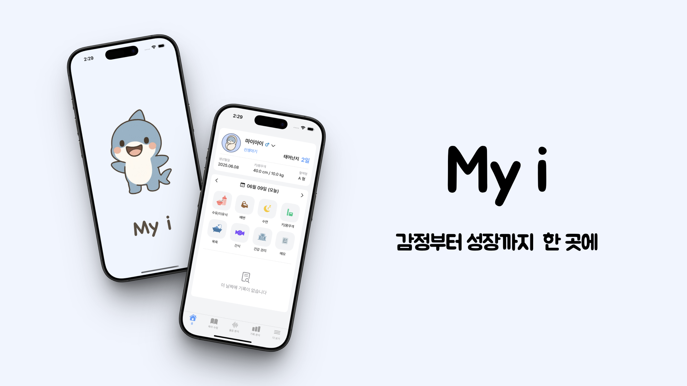

**My I**는 보호자가 아기의 신호를 이해하고 하루의 돌봄을 함께 기록하도록 돕는 iOS 육아 앱입니다.

## 프로젝트 소개

마이 아이는 울음 분석, 홈 타임라인, 육아 수첩, 통계, 알림을 하나의 흐름으로 묶어 매일 반복되는 판단·기록·공유 과정을 줄이는 데 초점을 둔 프로젝트입니다. 보호자가 아기의 상태와 일상을 같은 기준으로 확인하고, 여러 양육자가 필요한 정보를 놓치지 않도록 설계했습니다.

## 문제 정의와 해결 방향

### 핵심 사용자

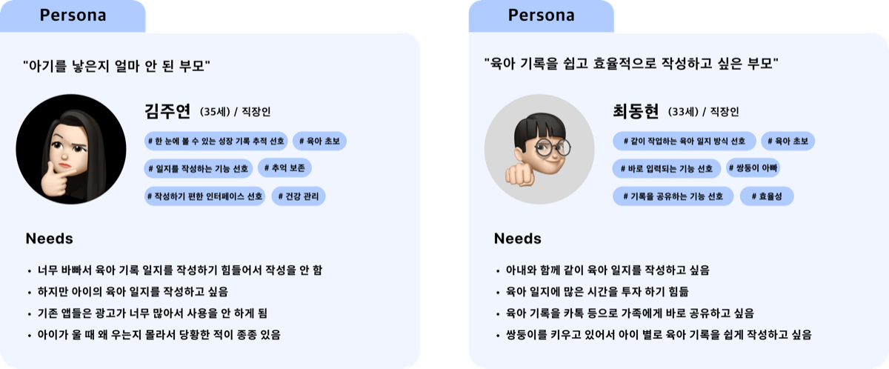

마이 아이의 주요 사용자는 신생아를 돌보는 초보 부모와 여러 보호자가 함께 육아 정보를 관리해야 하는 공동 양육자입니다. 이들은 아기의 울음 원인을 빠르게 파악하고, 반복적으로 발생하는 육아 기록을 보호자 간에 같은 기준으로 공유해야 합니다.

### 사용자가 겪는 문제와 해결 방식

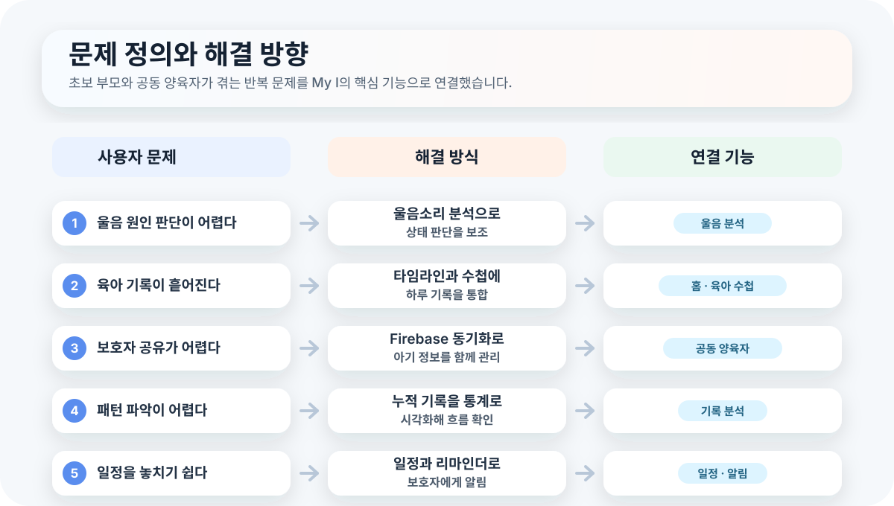

My I는 울음 분석과 기록, 통계, 알림을 한곳에 모아 반복되는 육아 기록의 부담을 줄입니다.

## 주요 기능

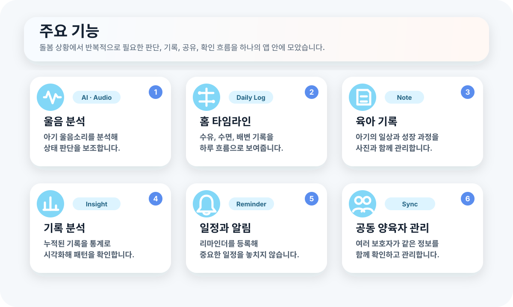

My I는 울음 분석부터 기록, 통계, 알림, 공동 양육자 관리까지 하루 돌봄에 필요한 흐름을 자연스럽게 이어줍니다.

## 대표 화면

|                                홈 타임라인                                |                               일정 기록                               |                                 울음 분석                                 |
|:-------------------------------------------------------------------------:|:---------------------------------------------------------------------:|:-------------------------------------------------------------------------:|
| 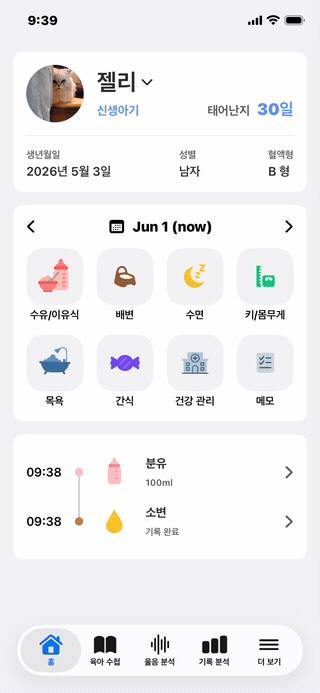 | 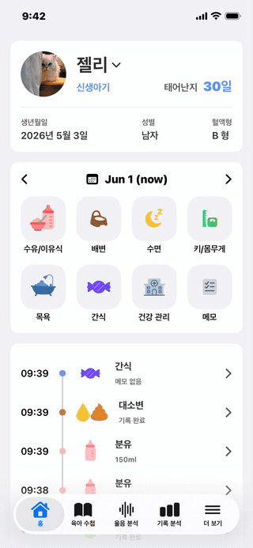 | 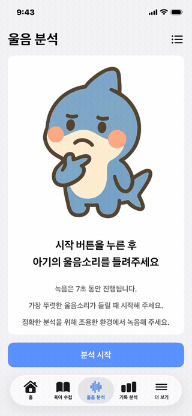 |
|                      육아 기록 추가 후 타임라인 반영                      |                     날짜별 기록 확인과 일정 관리                      |                        녹음부터 분석 결과까지 확인                        |

|                                기록 분석                                |                             더보기                             |                                   아기 정보 등록                                    |
|:-----------------------------------------------------------------------:|:--------------------------------------------------------------:|:-----------------------------------------------------------------------------------:|
| 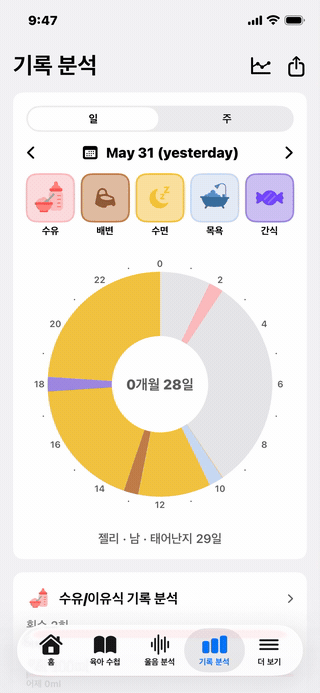 | 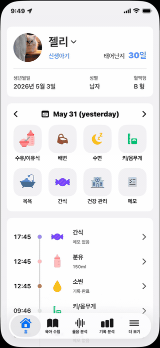 | 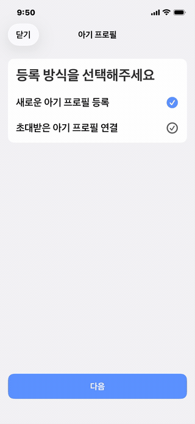 |
|                       누적 기록과 성장 흐름 확인                        |                계정, 아기 정보, 약관 화면 확인                 |                        새 아기 프로필 추가와 기본 정보 입력                         |

## 아키텍처

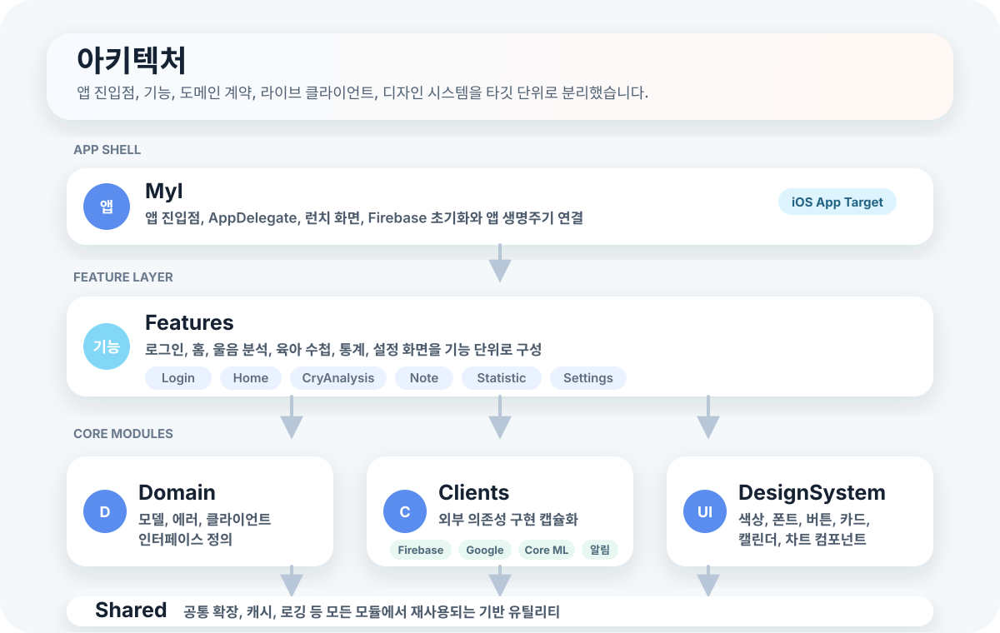

## 기술 스택

| 영역         | 기술                                                                                                              |
|--------------|-------------------------------------------------------------------------------------------------------------------|
| Language     | Swift 6.0                                                                                                         |
| UI           | SwiftUI                                                                                                           |
| Architecture | The Composable Architecture 1.25.5                                                                                |
| Backend      | Firebase 12.12.1, Cloud Firestore, Firebase Storage, Firebase Messaging, Firebase Crashlytics, Firebase Analytics |
| Auth         | Apple Sign In, Google Sign-In 9.1.0                                                                               |
| AI/Audio     | Core ML, AVFoundation                                                                                             |
| Project      | Tuist, Swift Package Manager                                                                                      |

## 실행 방법

저장소 루트에서 다음 명령을 실행합니다.

```bash
tuist install
tuist generate
open MyI.xcworkspace
```

## 개발 환경

| 항목              | 기준                        |
|-------------------|-----------------------------|
| iOS               | 17.0+                       |
| Swift             | 6.0                         |
| Project Generator | Tuist                       |
| Scheme            | `MyI`                       |
| Test Targets      | `FeaturesTests`, `MyITests` |
| CI Check          | SwiftFormat lint            |

## 문서

- [개인정보처리방침](privacy-policy.md)
- [이용약관](terms.md)
- [라이선스](LICENSE)
